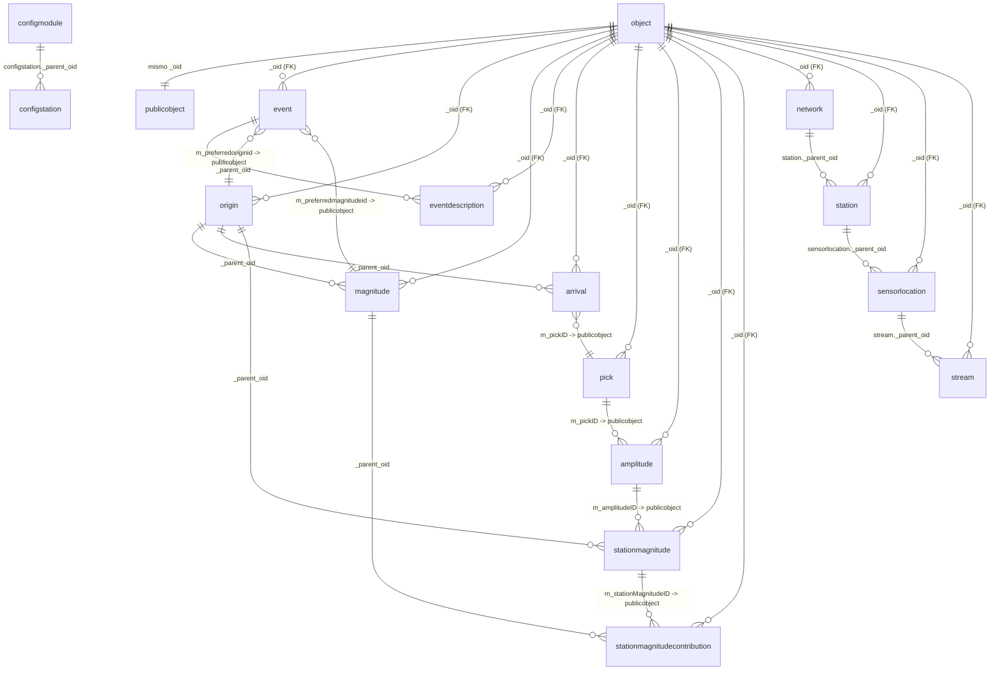

# Esquema relacional de SeisComp (tablas que usa este proyecto)

Resumen de las tablas de la base de SeisComp (`seiscomp2`) que consulta esta
herramienta, con sus relaciones y una descripción de cada una. No es el esquema
completo de SeisComp: cubre lo que el proyecto lee (exportación de eventos y
fases, y ampliación de estaciones sin arribos contra la base).

## Modelo de identidad

Toda la jerarquía de objetos de SeisComp comparte dos piezas:

- **`object`**: tabla base. `_oid` (PK) y `_timestamp`. La `_oid` de cada tabla
  de objetos es una clave foránea a esta.
- **`publicobject`**: mapea `_oid` → `m_publicid` (el identificador "público" en
  texto, por ejemplo `NLL.20260901...` o `Pick/...`). Es el puente que usa el
  proyecto: cuando se une por `m_preferredoriginid`, `m_pickID`, `m_amplitudeID`,
  etc., se pasa por acá.

O sea, hay **dos formas de enlazar** objetos:

1. Por `_parent_oid` (entero, apunta a la `_oid` del padre). El proyecto la usa
   para `arrival`, `magnitude`, `stationmagnitude`, `stationmagnitudecontribution`,
   `eventdescription` y toda la cadena de inventario.
2. Por **id público** (string), resolviendo con `publicobject`. El proyecto la
   usa para el origen/magnitud preferidos del evento, el `pick` de una `arrival`,
   la `amplitude` de un `pick` y la `stationmagnitude` de una `amplitude`.

## Diagrama (Mermaid)



> Nota: `origin._parent_oid` **no** apunta al `event` en esta base (verificado:
> 0 coincidencias). El evento se enlaza con su origen **preferido** por
> `event.m_preferredoriginid → publicobject.m_publicid → origin._oid`. Los
> enlaces marcados «→ publicobject» son por **id público** (string), no por
> `_parent_oid`.

## Diagrama (texto, para ver sin renderizador)

```
                          ┌────────────────────┐
                          │ object             │  tabla base de la jerarquía
                          │ _oid PK            │
                          │ _timestamp         │
                          └─────────┬──────────┘
                                    │ _oid (FK de TODAS las tablas)
   ┌────────────────────────────────┼──────────────────────────────────────────┐
   │                                │                                              │
   ▼                                ▼                                              ▼
┌────────────────────┐   ┌────────────────────┐                        ┌────────────────────┐
│ publicobject       │   │ event              │                        │ network            │
│ _oid PK            │   │ _oid PK            │                        │ _oid PK            │
│ m_publicid         │   │ m_preferredoriginid│───┐                    │ m_code             │
└────────────────────┘   │ m_preferredmagn..id│─┐ │                    │ m_start / m_end    │
   ▲   ▲   ▲   ▲         └─────────┬──────────┘ │ │                    └─────────┬──────────┘
   │   │   │   │                   │ _parent_oid│ │                              │ _parent_oid
   │   │   │   │                   ▼            │ │                              ▼
   │   │   │   │        ┌────────────────────┐  │ │                    ┌────────────────────┐
   │   │   │   │        │ eventdescription   │  │ │                    │ station            │
   │   │   │   │        │ _oid PK            │  │ │                    │ _oid PK            │
   │   │   │   │        │ _parent_oid        │  │ │                    │ _parent_oid        │
   │   │   │   │        │ m_text / m_type    │  │ │                    │ m_code, m_lat/lon  │
   │   │   │   │        └────────────────────┘  │ │                    │ m_start / m_end    │
   │   │   │   │                                │ │                    └─────────┬──────────┘
   │   │   │   │                                │ │ m_publicid                   │ _parent_oid
   │   │   │   │                                │ └──────────────► origin         ▼
   │   │   │   │                                │                  ▲     ┌────────────────────┐
   │   │   │   │                                └────────────────► │     │ sensorlocation     │
   │   │   │   │                                                     │     │ _oid PK            │
   │   │   │   │     ┌────────────────────┐  _parent_oid             │     │ _parent_oid        │
   │   │   │   └────►│ magnitude          │◄─────────────             │     │ m_code, épocas     │
   │   │   │         │ _oid PK            │◄── _parent_oid = origin  │     └─────────┬──────────┘
   │   │   │         │ _parent_oid        │                          │               │ _parent_oid
   │   │   │         │ m_magnitude_value  │                          │               ▼
   │   │   │         │ m_stationcount ... │                          │     ┌────────────────────┐
   │   │   │         └─────────┬──────────┘                          │     │ stream             │
   │   │   │                   │ _parent_oid                         │     │ _oid PK            │
   │   │   │                   ▼                                     │     │ _parent_oid        │
   │   │   │         ┌────────────────────────────┐                  │     │ m_code (canal)     │
   │   │   │         │ stationmagnitudecontribution│                 │     │ m_start / m_end    │
   │   │   │         │ _oid PK                    │                  │     └────────────────────┘
   │   │   │         │ _parent_oid = magnitude    │                  │
   │   │   │         │ m_stationMagnitudeID       │                  │
   │   │   │         │ m_residual                 │                  │
   │   │   │         └────────────────────────────┘                  │
   │   │   │                                                         │
   │   │   │  ┌────────────────────┐   _parent_oid = origin          │
   │   │   └─►│ stationmagnitude   │◄────────────────────────────────┘
   │   │      │ _oid PK            │
   │   │      │ _parent_oid        │
   │   │      │ m_amplitudeID      │
   │   │      │ m_magnitude_value  │
   │   │      │ m_passedQC         │
   │   │      └─────────┬──────────┘
   │   │                │ m_amplitudeID
   │   │                ▼
   │   │      ┌────────────────────┐        ┌────────────────────┐
   │   │      │ amplitude          │        │ arrival            │
   │   │      │ _oid PK            │        │ _oid PK            │
   │   │      │ m_pickID           │        │ _parent_oid=origin │
   │   │      │ m_snr              │        │ m_pickID           │
   │   │      │ m_magnitudehint    │        │ m_phase_code       │
   │   │      └─────────┬──────────┘        │ m_timeUsed/weight  │
   │   │                │ m_pickID          └─────────┬──────────┘
   │   │                ▼                             │ m_pickID
   │   │      ┌───────────────────────────────────────▼──────────┐
   │   └─────►│ pick                                             │
   │          │ _oid PK, _parent_oid, m_time_value               │
   │          │ m_waveformID_{network,station,location,channel}  │
   │          │ m_evaluationmode (manual/automatic)              │
   │          └──────────────────────────────────────────────────┘
   │
   └── (los enlaces por id público pasan por publicobject.m_publicid)
```

## Descripción de cada tabla

### Modelo de identidad

- **`object`**: tabla base de toda la jerarquía. `_oid` (PK), `_timestamp`. La
  `_oid` de cada tabla de objetos es FK a esta. El proyecto no la consulta
  directo; aparece por las claves foráneas.
- **`publicobject`**: `_oid` (PK) y `m_publicid`. Traduce la `_oid` interna al id
  público en texto. Es el puente de los enlaces por `m_preferredoriginid`,
  `m_pickID`, `m_amplitudeID`, `m_stationMagnitudeID`.

### Solución sísmica

- **`event`**: el evento. Interesan `_oid`, `m_preferredoriginid`,
  `m_preferredmagnitudeid` y `m_type`. No guarda lat/lon/hora: eso vive en
  `origin`.
- **`eventdescription`**: descripción del evento. El proyecto toma como
  **región** la fila con `m_type = 'region name'`. Hija del evento por
  `_parent_oid`.
- **`origin`**: la solución hipocentral. `m_time_value` (hora origen),
  `m_latitude_value`, `m_longitude_value`, `m_depth_value`,
  `m_evaluationstatus` (p. ej. `confirmed`) y el bloque `m_quality_*` (fases
  usadas, RMS, azGap). En el proyecto es el origen **preferido** del evento.
- **`magnitude`**: magnitud de un origen; se usa la **preferida**
  (`event.m_preferredmagnitudeid`). `m_magnitude_value`, `m_type`. Hija del
  origen por `_parent_oid`.

### Lecturas y magnitudes por estación

- **`arrival`**: una llegada (fase) asociada al origen.
  `_parent_oid = origin._oid`, `m_pickID` (→ `pick`), `m_phase_code` (P/S…),
  `m_timeUsed` (si entró a la solución), `m_weight`, `m_timeResidual`,
  `m_azimuth`, `m_distance`.
- **`pick`**: la lectura propiamente dicha. Hora `m_time_value`, código de forma
  de onda `m_waveformID_networkCode`/`_stationCode`/`_locationCode`/`_channelCode`
  y `m_evaluationmode` (`manual`/`automatic`), más autor/agencia/método. Es lo
  que muestra la columna «Modo» de la ventana de Estaciones.
- **`amplitude`**: amplitud medida sobre un pick (`m_pickID`), con `m_snr`. El
  proyecto la usa para el SNR de la fase y como puente hacia la magnitud de
  estación.
- **`stationmagnitude`**: magnitud calculada por una estación para un origen.
  `_parent_oid = origin._oid`, `m_amplitudeID` (→ `amplitude`),
  `m_magnitude_value`, `m_type`, `m_passedQC` (aprobado/rechazado).
- **`stationmagnitudecontribution`**: cuánto aporta una `stationmagnitude` a la
  **magnitud** preferida. `_parent_oid = magnitude._oid`,
  `m_stationMagnitudeID`, `m_residual`.

### Inventario

- **`network`**: red. `m_code`, vigencia `m_start`/`m_end`.
- **`station`**: estación, hija de la red (`_parent_oid`). `m_code`, coordenadas
  `m_latitude`/`m_longitude`/`m_elevation`, `m_place`, `m_country`, vigencia.
- **`sensorlocation`**: código de ubicación (*location code*), hija de la
  estación. `m_code`, vigencia.
- **`stream`**: canal/stream, hijo del sensor location. `m_code` (p. ej. `BHZ`),
  vigencia y metadatos de sensor/datalogger/muestreo.

### Configuración (bindings)

- **`configmodule`**: el módulo de config. En esta base hay uno solo, `m_name =
  'trunk'` (los `etc/init/*.py` de SeisComp devuelven `"trunk"` en
  `updateConfigProxy()`, así que `trunk` es el proxy de config por defecto).
- **`configstation`**: las estaciones con binding, hijas del módulo por
  `_parent_oid`. `m_networkcode`, `m_stationcode`, `m_enabled`. Es lo que
  SeisComp tiene **configurado procesar**: un subconjunto del inventario (puede
  haber dataless cargado sin binding). En esta base: 334 de 477 estaciones.

## Relaciones que usa el proyecto

- **Inventario**: `network → station → sensorlocation → stream`, toda por
  `_parent_oid`. Es la cadena que se valida completa para «Sin arribos».
- **Bindings**: `configmodule → configstation` por `_parent_oid`. Acota el
  listado de «Sin arribos» a las estaciones que SeisComp trabaja.
- **Evento → solución**: `event.m_preferredoriginid` y
  `m_preferredmagnitudeid`, vía `publicobject`.
- **Origen → llegadas**: `arrival._parent_oid = origin._oid`.
- **Llegada → lectura**: `arrival.m_pickID` vía `publicobject` → `pick`.
- **Pick → amplitud**: `amplitude.m_pickID` vía `publicobject`.
- **Origen → magnitud de estación**: `stationmagnitude._parent_oid = origin._oid`;
  `stationmagnitude.m_amplitudeID` → `amplitude`.
- **Magnitud → contribución**: `stationmagnitudecontribution._parent_oid =
  magnitude._oid`; `m_stationMagnitudeID` → `stationmagnitude`.
- **Evento → región**: `eventdescription._parent_oid = event._oid`.

## Qué tablas se consultan en cada recorrido

- **Exportación** (genera los tres CSV): `event`, `publicobject`, `origin`,
  `magnitude`, `eventdescription`, `arrival`, `pick`, `amplitude`,
  `stationmagnitude`, `stationmagnitudecontribution`, `network`, `station`,
  `sensorlocation`, `stream`, y los bindings `configstation`/`configmodule`.
- **Seleccionar un evento / abrir la ventana Estaciones**: ninguna. Todo sale de
  los CSV (`<salida>.csv`, `_fases.csv`, `_no_picadas.csv`).
- **Ampliar el radio de un evento** («Ampliar» / «Todo (sin límite)»):
  - Inventario: `network`, `station`, `sensorlocation`, `stream`.
  - Bindings: `configstation`, `configmodule`.
  - Actividad: `event`, `publicobject`, `origin`, `arrival`, `pick`.

## Notas

- `origin._parent_oid` no enlaza con `event` en esta base; el vínculo es por el
  id del origen preferido a través de `publicobject`.
- `pick` y `amplitude` tienen `_parent_oid`, pero el proyecto no lo usa: los
  enlaza por id público (`arrival.m_pickID`, `amplitude.m_pickID`).
- Las vigencias van en `m_start`/`m_end` (con `m_start_ms`/`m_end_ms`) en
  `network`, `station`, `sensorlocation` y `stream`; una época abierta deja
  `m_end` en NULL.
- `object` solo tiene `_oid` y `_timestamp`; no guarda el tipo. El tipo se deduce
  de en qué tabla de objeto aparece la `_oid`.
