# Manual de usuario — RevisaPubSeisan

Guía de operación para la revisión de publicaciones sísmicas.
Versión 2.0 — 6 de octubre de 2026.

Este manual está pensado para una persona con conocimientos básicos de
sismología que no necesita conocer el código. Explica, pantalla por pantalla,
qué hace el sistema y qué significa cada botón. El detalle interno (scripts,
parámetros, base de datos) está en el **`manual_tecnico.md`**.

> Las versiones anteriores (1.1, de octubre de 2026) quedaron archivadas en
> `docs/versiones/`. Este es el documento vigente.

---

## Índice

1. [Qué hace el sistema](#1-qué-hace-el-sistema)
2. [Requisitos e instalación](#2-requisitos-e-instalación)
3. [Antes de empezar: solicitud de catálogos](#3-antes-de-empezar-solicitud-de-catálogos)
4. [Ventana principal](#4-ventana-principal)
5. [Recorridos: procesar y consultar](#5-recorridos-procesar-y-consultar)
6. [El panel de análisis](#6-el-panel-de-análisis)
7. [El catálogo de SeisComp](#7-el-catálogo-de-seiscomp)
8. [Parámetros y Estaciones del evento](#8-parámetros-y-estaciones-del-evento)
9. [Análisis rápido de sin arribos](#9-análisis-rápido-de-sin-arribos)
10. [Descargas](#10-descargas)
11. [Problemas frecuentes](#11-problemas-frecuentes)
12. [Glosario](#12-glosario)

---

## 1. Qué hace el sistema

RevisaPubSeisan **contrasta** lo que publicó el sistema automático de detección
sísmica (Seisan, en el servidor local) y el catálogo sísmico de SeisComp con el
**catálogo público** de eventos (consultado por `eventquery`). El objetivo es
responder preguntas concretas de control de calidad:

- ¿Qué eventos **no se publicaron** aunque el sistema los detectó?
- ¿Qué eventos **se publicaron con datos distintos** (latitud, longitud,
  profundidad o magnitud) de los procesados?
- ¿Qué eventos están **repetidos** dentro de una misma fuente?
- ¿Qué eventos quedaron **excluidos** y por qué?
- ¿Cómo se ubican los eventos respecto de la **zona de subducción** (perfiles)?

Además arma **mapas** y un **panel de análisis** por perfil, y marca como
**sospechosos** (posible mal localización) los eventos que no calzan con la
placa ni con la sismicidad histórica.

**Importante:** el sistema **no modifica** los datos de origen. Todo lo que
genera se escribe en archivos nuevos dentro de la carpeta desde donde se lanza.

---

## 2. Requisitos e instalación

El punto de entrada es el script `supervisor.sh`, que se ejecuta **desde la
carpeta del proyecto**:

```
./supervisor.sh
```

La primera vez crea un entorno virtual (`.venv`) e instala las dependencias
(puede tardar varios minutos). Requiere:

- **Python 3.7 o superior** y el paquete `python3-venv`.
- Un compilador y la biblioteca **GEOS** del sistema (para compilar Shapely).
  Si falla, el mensaje indica instalar `libgeos-dev`.

Todos los resultados se crean **junto a donde se ejecuta la app** (no junto al
código): las carpetas `datos/`, `informes/`, `descargas/`, `ploteo/` y
`trabajo/` se crean solas la primera vez.

También existe un **modo antiguo** para revisar un período suelto con el
catálogo ya elegido:

```
./supervisor.sh <archivo_entrada.csv> <archivo_salida.dat>
```

---

## 3. Antes de empezar: solicitud de catálogos

Al lanzar `./supervisor.sh` **sin argumentos** se abre la ventana de solicitud:

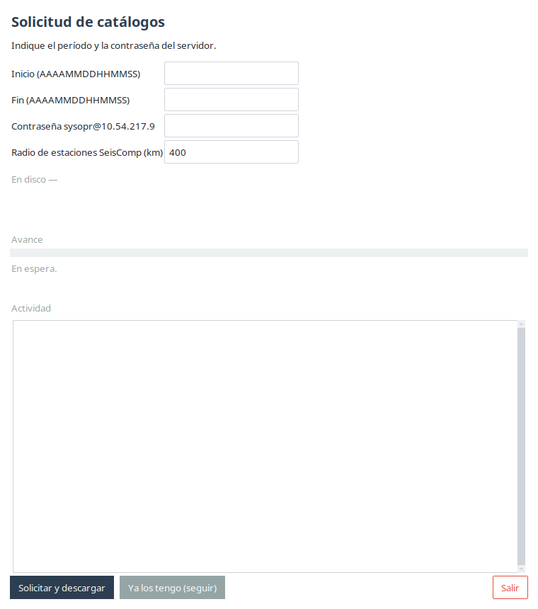

Campos y controles:

| Elemento | Para qué sirve |
|---|---|
| **Inicio** / **Fin** (`AAAAMMDDHHMMSS`) | El período a revisar, con 14 dígitos (año, mes, día, hora, minuto, segundo). |
| **Contraseña** `sysopr@10.54.217.9` | La clave del servidor remoto, donde viven los catálogos de Seisan y eventquery. |
| **Radio de estaciones SeisComp (km)** | Radio (por defecto 400 km) con el que se exportan las estaciones de SeisComp alrededor de cada evento. Solo afecta a SeisComp. |
| **En disco —** | Indicador (neutro) de qué archivos ya existen para el período escrito y si la exportación de SeisComp se va a reutilizar o a consultar. |
| **Avance** / **Actividad** | Barra de progreso y cronómetro, con una línea que dice qué se está obteniendo. |

Botones:

- **«Solicitar y descargar»**: baja del servidor lo que falte (Seisan y
  eventquery) y exporta la ventana de SeisComp para el mismo período.
- **«Ya los tengo (seguir)»**: abre la revisión sin bajar nada; exige que los
  archivos de esa ventana ya estén en la carpeta (si faltan, los lista en rojo).
- **«Salir»**: cierra.

Si hay varias ventanas de catálogos en la carpeta, la app **precarga la más
reciente** y lo avisa, así «Ya los tengo» funciona sin tipear las fechas.

---

## 4. Ventana principal

Al terminar la solicitud se abre la ventana principal:

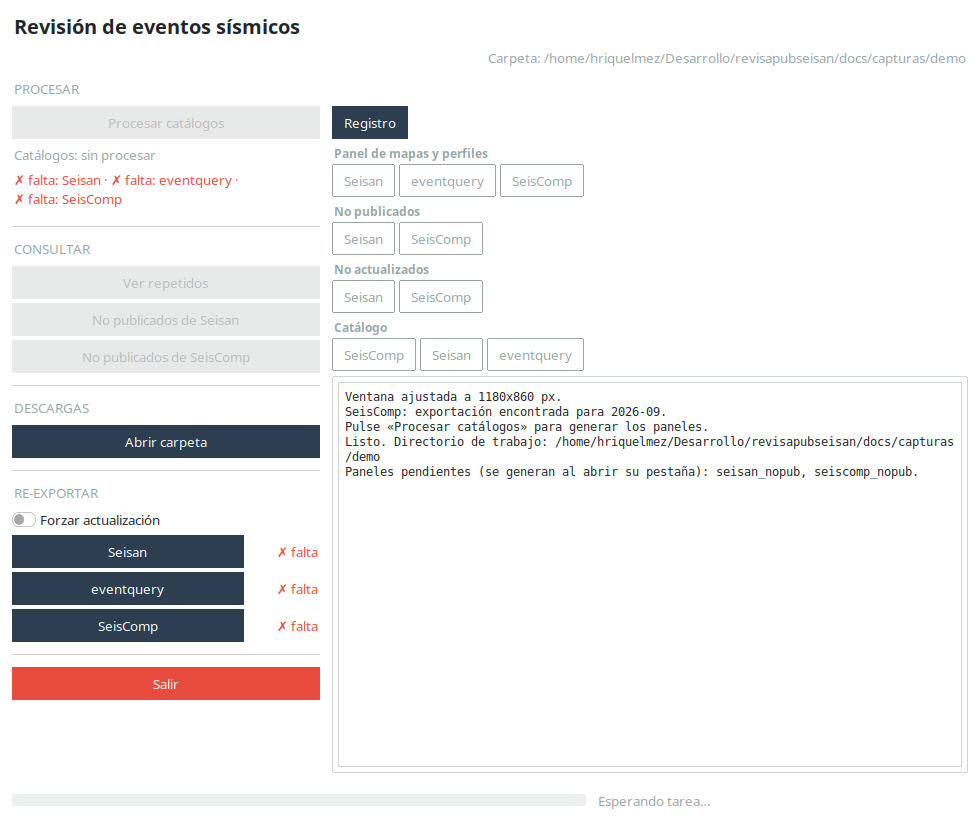

Se divide en tres zonas: una **barra lateral** de acciones, la **barra de
pestañas agrupadas** y el **área de contenido** con el registro y los paneles al
final.

### Barra lateral

**PROCESAR**

- **«Procesar catálogos»**: el botón de trabajo principal. Corre el análisis
  (comparación, atribución, excluidos, repetidos) y, con los mismos catálogos,
  genera los paneles de todas las fuentes. Una sola pulsación deja todo listo.
  Si ya se procesó antes, pide confirmación antes de rehacer.
- Debajo, una etiqueta de estado: `Catálogos: sin procesar / procesados /
  procesando…`, y el aviso `✓ Catálogos OK.` o los que fallaron/faltan.

**CONSULTAR**

- **«Ver repetidos»**: abre los informes de eventos repetidos.
- **«No publicados de Seisan»** / **«No publicados de SeisComp»**: abre el
  listado de eventos publicados que el sistema no publicó (magnitud ≥ 2.5).

**DESCARGAS**

- **«Abrir carpeta»**: abre la carpeta de descargas del análisis.

**RE-EXPORTAR**

- Tilde **«Forzar actualización»**: habilita los botones de re-exportar aunque
  el catálogo figure al día (por ejemplo, si se corrigió la fuente en el
  servidor).
- **«Seisan»** / **«eventquery»** / **«SeisComp»**: vuelven a obtener el
  catálogo correspondiente. Cada uno tiene a la derecha un **chip** con su
  estado: `✓ OK`, `✗ falló`, `✗ falta` o `⚠ cambió`. Sin el tilde, solo se
  habilita el que falta o cambió.
- **«Salir»**: cierra la aplicación.

> Re-importar un catálogo **obliga a reprocesar** todo el análisis, porque la
> información cruza datos entre catálogos. Al pulsar «Re-exportar» aparece un
> popup que lo avisa; si se acepta, tras la bajada el análisis corre solo.

### Barra de pestañas

Las pestañas se agrupan en filas: **Registro**; **Panel de mapas y perfiles**
(Seisan, eventquery, SeisComp); **No publicados** (Seisan, SeisComp); **No
actualizados** (Seisan, SeisComp); **Catálogo** (SeisComp, Seisan, eventquery).

- **Registro**: bitácora de lo que hace la app. Es lo primero que conviene
  mirar al terminar una etapa.
- **Panel de mapas y perfiles**: es donde están los **mapas y los perfiles de
  subducción** de cada fuente (Seisan, eventquery y SeisComp). Cada pestaña
  muestra la tabla de perfiles y el perfil de referencia; con doble clic en una
  fila se abre el detalle (mapa en planta y perfil).
- **No publicados** / **No actualizados**: listados de control de calidad.
- **Catálogo**: el listado crudo de eventos de cada fuente.

Al pie hay una **barra de progreso** con la etapa en curso (por ejemplo,
`40 % · Comparando publicados v/s procesados`).

---

## 5. Recorridos: procesar y consultar

### Procesar

Pulse **«Procesar catálogos»** y siga el avance. Al terminar, en el **Registro**
figura cuántos eventos quedaron con perfil y cuántos sin perfil, con el motivo.

### Ver repetidos

Abre una tabla con los informes de repeticiones por fuente y filtro (amplio y
estricto). El panel de abajo muestra el informe seleccionado y **«Descargar
informe»** baja el completo:

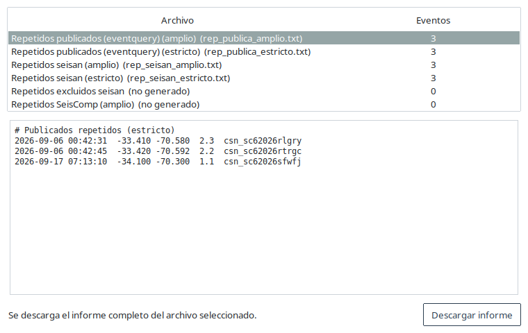

### No publicados

Listado de eventos que están en el catálogo público pero no en la solución
local, con filtro por texto y descargas:

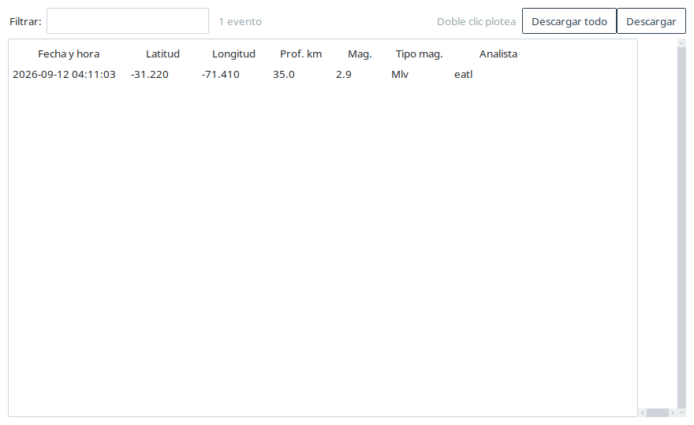

- **«Descargar»** baja lo que se ve (con el filtro puesto); **«Descargar
  todo»** baja el listado entero.
- **Doble clic** en una fila (la ventana lo recuerda: «Doble clic plotea»)
  abre el evento en una figura con la vista en planta y el perfil de subducción,
  para ver su ubicación en contexto (contra el *slab* y la sismicidad histórica)
  y juzgar de inmediato si, por localización, debería estar publicado:

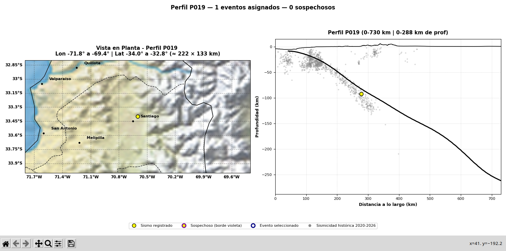

### No actualizados

Listado de eventos **sí publicados** pero cuyos parámetros difieren de los
procesados. Muestra, por parámetro, el valor local y el publicado, los deltas,
la **distancia (km)** entre ambas ubicaciones y una columna final con **qué
parámetros discreparon**:

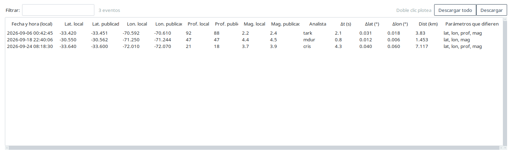

La comparación es **numérica**. Como el catálogo publicado (el que arma
«publica») guarda lat/lon con **2 decimales** y la solución local con 3, las
coordenadas se comparan con una **tolerancia de 0,005°** (media centésima) para
no marcar como distinto el mismo evento por el redondeo de la publicación.
Profundidad y magnitud se comparan **exactas a 1 decimal**. Se puede ordenar por
cualquier columna (incluida **Dist (km)**) haciendo clic en su encabezado.

**Doble clic** en una fila abre la figura de planta + perfil con **las dos
soluciones**: el **evento Seisan/SeisComp** (amarillo) y el **publicado** (anillo
azul con centro blanco), unidos por una línea y con el **Δ de ubicación, de
profundidad y de magnitud** (abajo a la derecha; la magnitud aparece solo si
difiere, y con el **tipo** cuando cambia, p. ej. `Mlv vs ML`). Así se ve en el
mapa la diferencia hipocentral, no solo el km de la tabla:

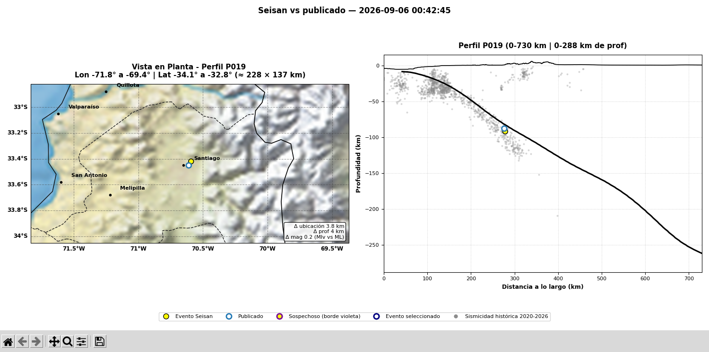

---

## 6. El panel de análisis

Las pestañas del grupo **Panel de mapas y perfiles** de cada fuente muestran el
panel de análisis: a la izquierda la tabla de perfiles de subducción y a la
derecha un mini-perfil de referencia.

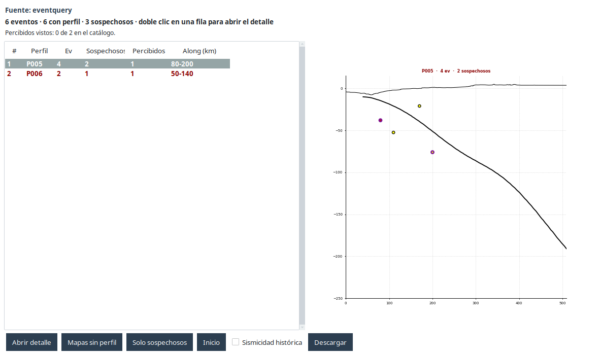

### Tabla de perfiles

| Columna | Qué indica |
|---|---|
| **#** | Número de orden. |
| **Perfil** | Identificador del perfil de subducción (p. ej. `P005`). |
| **Ev** | Cantidad de eventos asignados a ese perfil. |
| **Sospechosos** | Cuántos de esos eventos quedaron marcados como sospechosos. |
| **Percibidos** | Cuántos fueron reportados como percibidos por la población. |
| **Along (km)** | Rango de distancia a lo largo del perfil. |

Los perfiles con sospechosos se muestran en rojo.

### Mini-perfil

Dibuja el perfil seleccionado: topografía, el contacto de placas (*slab*) y los
eventos. Los **sospechosos** llevan un borde violeta. Al seleccionar una fila se
redibuja.

### Botones

- **«Abrir detalle»**: abre los mapas del perfil seleccionado (equivale a doble
  clic en la fila).
- **«Mapas sin perfil»**: abre los eventos que quedaron sin perfil, agrupados
  por territorio (Nacional, Insular, Antártico).
- **«Solo sospechosos»** (cambia a **«Todos los perfiles»**): filtra la tabla a
  los perfiles con al menos un sospechoso.
- **«Inicio»**: vuelve al estado inicial (sin filtro).
- **«Sismicidad histórica»**: prende/apaga el fondo de sismicidad histórica.
- **«Descargar»**: baja eventos de un ámbito (ver [Descargas](#10-descargas)).

En las figuras de detalle hay una barra de herramientas de matplotlib
(*zoom*, *pan*, guardar). En modo *zoom* o *pan*, un clic selecciona un evento y
un arrastre hace zoom o mueve la vista; **Esc** sale del modo. El botón
**«Detener»** (rojo, abajo a la derecha) cierra las figuras de detalle.

---

## 7. El catálogo de SeisComp

La pestaña **Catálogo → SeisComp** muestra el listado de eventos de la
exportación de SeisComp:

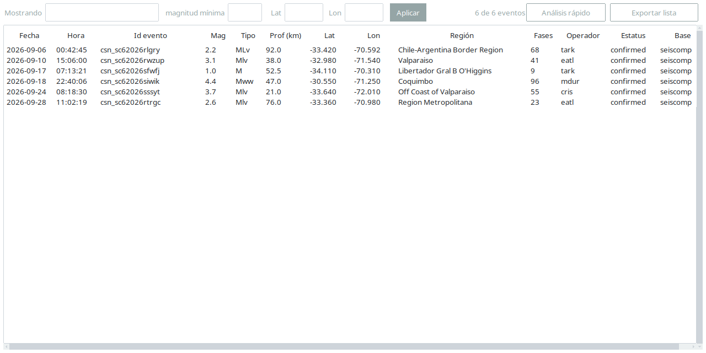

Controles de la barra superior:

- **«Mostrando»**: filtro de texto libre (busca en todo lo visible).
- **«magnitud mínima»**: filtra por magnitud.
- **«Lat»** / **«Lon»**: filtran por latitud/longitud.
- **«Aplicar»**: aplica los filtros.
- **«Análisis rápido»**: abre la revisión acotada de *sin arribos* (ver
  [sección 9](#9-análisis-rápido-de-sin-arribos)). Solo aparece si la
  exportación trae el archivo de estaciones sin arribos.
- **«Exportar lista»**: baja el listado con el filtro y el orden en pantalla.

Se puede **ordenar por cualquier columna** haciendo clic en su encabezado (un
clic ordena ascendente, otro descendente).

### Abrir un evento

Al hacer **doble clic** en una fila (o Enter con la fila elegida) se abren los
**Parámetros del evento** en una ventana aparte, que se reutiliza al cambiar de
evento y **no bloquea** la lista.

---

## 8. Parámetros y Estaciones del evento

### Parámetros del evento

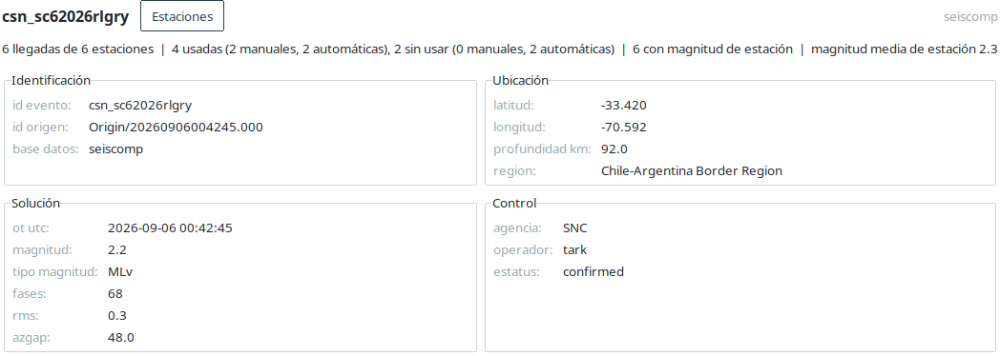

Muestra los datos del evento agrupados en **Identificación**, **Ubicación**,
**Solución** y **Control** (donde está el **operador/analista**). El botón
**«Estaciones»** abre la ventana de estaciones.

### Estaciones del evento

Tiene dos solapas. En el encabezado, **siempre visible**, van los parámetros del
evento y el **analista** en negrita, para no perder de vista qué evento se está
mirando.

**Solapa «Con arribos»**: las llegadas de la solución preferida, agrupadas por
estación. Muestra, por cada *pick*, si fue **manual o automático**, con su autor,
agencia y método. Los *picks* manuales se resaltan (fuerte si entraron a la
solución, suave si quedaron afuera):

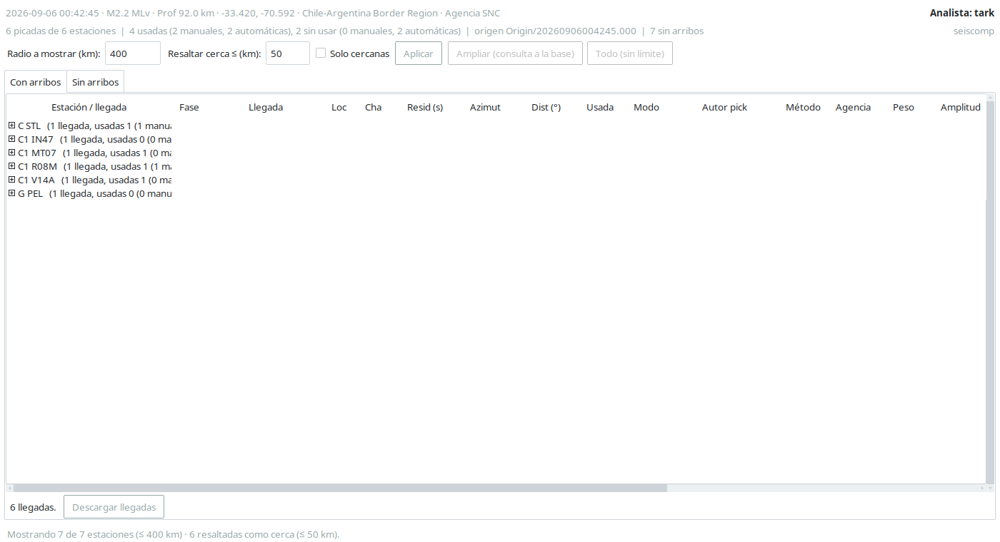

**Solapa «Sin arribos»**: las estaciones que estaban configuradas en el
inventario y quedaron dentro del radio, pero **no tienen arribos** en el origen
preferido:

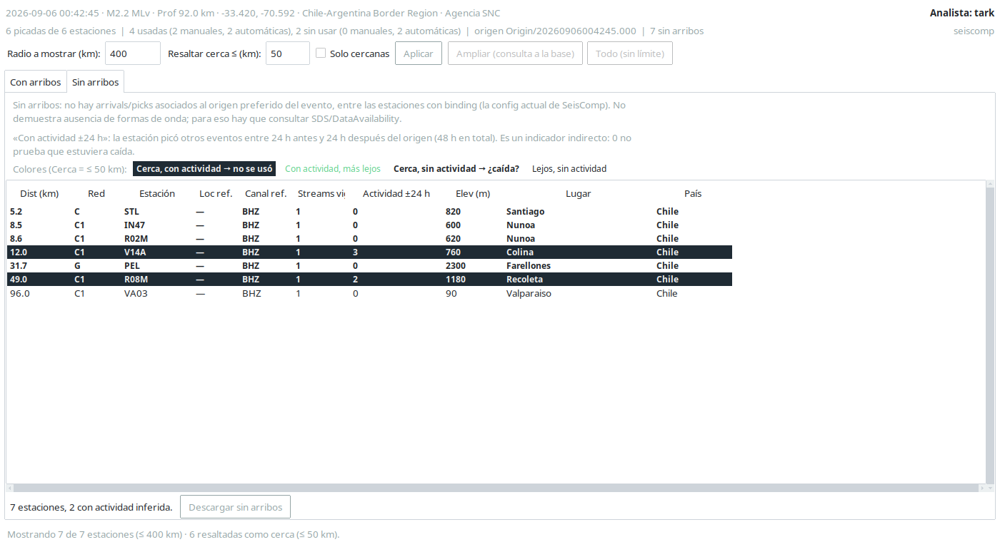

> **Ojo:** «sin arribos» **no** significa «no grabó». La base de SeisComp no sabe
> qué estaciones tienen formas de onda de cada evento; eso vive en el archivo de
> ondas. Por eso la columna **«Actividad ±24 h»** es solo un indicador indirecto:
> cuenta otros eventos que esa estación picó entre 24 h antes y 24 h después del
> origen (48 h en total). Un 0 no prueba que la estación estuviera caída.

El resaltado cruza dos umbrales independientes del radio:

- **fondo destacado** — *cerca **y** con actividad*: estaba operando cerca y
  **no se usó** en la solución (posible pérdida de calidad).
- **verde** — *con actividad, más lejos*.
- **negrita** — *cerca **y** sin actividad*: **¿caída?**.
- **normal** — *lejos y sin actividad*.

Controles del encabezado (bloque **Distancias**):

- **«Radio a mostrar (km)»**: **recorta** la lista ya exportada; no consulta la
  base. Arranca con el radio de la exportación (400 km por defecto).
- **«Resaltar cerca ≤ (km)»**: umbral de resaltado «cerca» (50 km por defecto).
  **Solo cambia el color, no recorta la lista.** Se aplica en vivo mientras
  escribís.
- **«Solo cercanas»**: marcado, recorta la lista a las estaciones dentro del
  umbral «cerca» (además del radio).
- **«Aplicar»** (o Enter en cualquiera de las casillas): aplica el recorte del
  radio y el estado de «Solo cercanas».
- **«Ampliar (consulta a la base)»**: recalcula, **para ese evento**, el
  inventario vigente a su hora y la actividad, y muestra el resultado en otra
  ventana (para no pisar el corte exportado).
- **«Todo (sin límite)»**: igual que ampliar, pero sin tope de distancia.

Debajo de los controles hay una **línea de estado** que aclara qué se está
viendo, por ejemplo: *«Mostrando 7 de 7 estaciones (≤ 400 km) · 6 resaltadas
como cerca (≤ 50 km)»*. Si cambiás el radio y no lo aplicaste, agrega
*(radio sin aplicar)*.

Cada solapa tiene su botón de descarga (**«Descargar llegadas»** /
**«Descargar sin arribos»**).

---

## 9. Análisis rápido de sin arribos

El botón **«Análisis rápido»** del catálogo de SeisComp recorre **TODO el
catálogo** (no usa el filtro del panel, y lo advierte) y lista los eventos que
tienen estaciones **sin arribos cercanas**, para acotar la revisión a esos
casos.

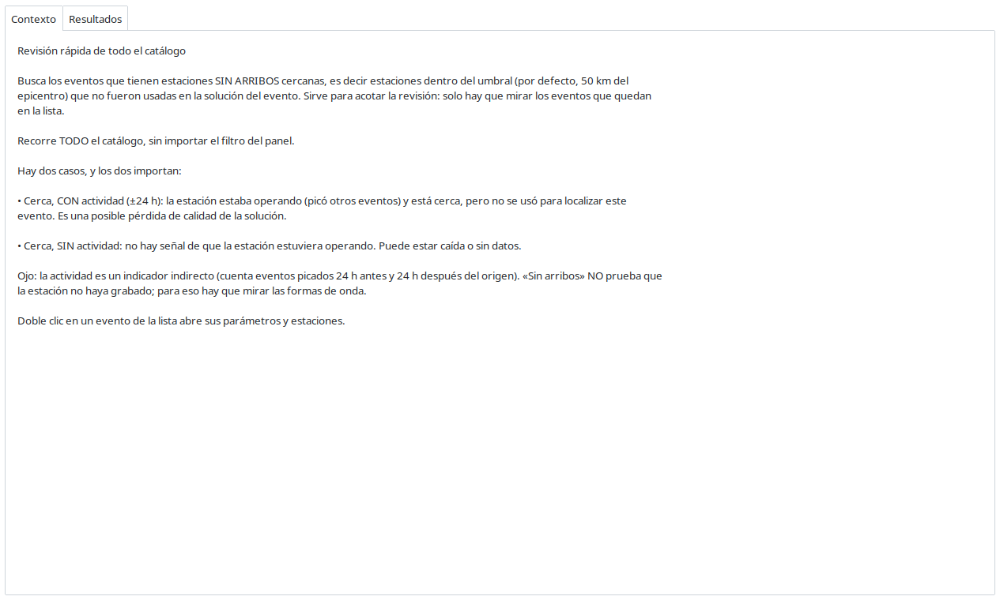

La pestaña **Contexto** explica en corto qué mide y cómo se lee.

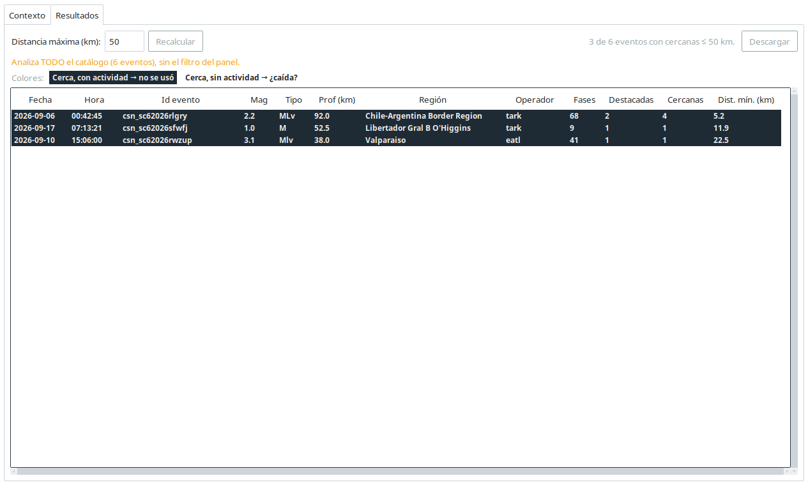

La pestaña **Resultados** trae los datos clave del evento y el **operador**, más
cuántas estaciones cercanas son *con actividad* (**no se usó**) y cuántas *sin
actividad* (**¿caída?**). Controles:

- **«Distancia máxima (km)»** + **«Recalcular»**: cambian el umbral y recalculan
  en el acto.
- Clic en un encabezado: reordena (ascendente → descendente → vuelta al orden
  por severidad, marcado con ▲/▼).
- **«Descargar»**: baja el resultado en formato largo (una fila por evento y
  estación cercana).
- **Doble clic** en un evento: abre sus parámetros y estaciones.

---

## 10. Descargas

Todo lo que se baja va a la carpeta **`descargas/`** dentro de la carpeta del
análisis, y se abre con **«Abrir carpeta»**. Al descargar, la app pregunta el
formato:

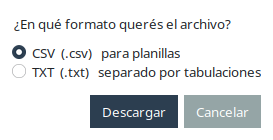

- **CSV** (separado por comas), para planillas.
- **TXT** (separado por tabulaciones), para pegar en planillas.

El diálogo recuerda el formato de la descarga anterior. En las vistas con tabla,
**«Descargar»** arma el archivo con el **filtro y el orden en pantalla**, y
**«Descargar todo»** lo escribe entero.

---

## 11. Problemas frecuentes

- **Un catálogo no se pudo bajar.** La app ya no se detiene: avisa cuáles
  quedaron afuera y habilita el botón de **Re-exportar** correspondiente.
- **«La base no responde» al ampliar.** La ampliación necesita conexión a la
  base de SeisComp; si no está, avisa y deja el corte exportado como estaba.
- **La solapa «Sin arribos» dice que falta el archivo.** Es una exportación
  anterior a la función de sin arribos; hay que **re-exportar** la ventana.
- **La ventana se achicó / no se ve completa.** La app **solo crece**; si un
  monitor es chico, use las barras de desplazamiento de cada tabla (horizontal y
  vertical).
- **Un evento quedó «sin perfil».** No siempre es un error: puede estar fuera de
  la cobertura de las grillas. El Registro y el conteo de perfiles indican el
  motivo.

---

## 12. Glosario

- **Evento**: un sismo con su solución (hora, latitud, longitud, profundidad,
  magnitud).
- **Origen preferido**: la solución hipocentral que el sistema elige como
  principal para un evento.
- **Arribo / *pick***: la lectura de una fase (P, S…) en una estación. Un *pick*
  es **manual** si lo hizo un analista y **automático** si lo hizo el autopicker.
- **Catálogo público (`eventquery`)**: los eventos publicados oficialmente.
- **`select` / Seisan**: la selección y solución local procesada por el sistema.
- **SeisComp**: el sistema de adquisición y procesamiento que aporta su propia
  solución, inventario y *bindings*.
- **No publicado**: evento detectado localmente que no aparece en el catálogo
  público.
- **No actualizado**: evento publicado cuyos parámetros difieren de la solución
  local.
- **Repetido**: dos o más eventos que coinciden en tiempo y coordenadas dentro de
  una tolerancia.
- **Excluido**: evento del `select` al que le faltan datos (magnitud, coordenadas
  o RMS).
- **Perfil de subducción**: una sección a lo largo de la zona de subducción a la
  que se asigna cada evento.
- **Sospechoso**: evento posiblemente mal localizado (no calza con la placa ni
  con la sismicidad histórica), o sin perfil asignado.
- **Sin arribos**: estación del inventario, dentro del radio, que no tiene un
  arribo asociado al evento. No implica que no haya grabado.
- **Actividad ±24 h**: cuántos *otros* eventos picó esa estación dentro de las
  24 h anteriores y posteriores al origen. Indicador indirecto de que estaba
  operando.
